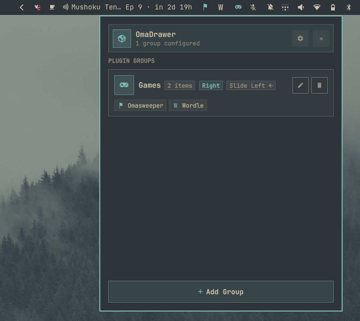

# OmaDrawer for Omarchy

A native [Omarchy](https://omarchy.org/) status bar plugin that bundles your bar widgets into clean, collapsible, slide-out drawers - each group an independent, draggable slot on your bar.



## Features

- **Collapsible Drawer Groups:** Bundle multiple status bar widgets into compact, expandable slide-out drawers.
- **Independent Draggable Groups:** Every drawer group is its own bar slot. Drag it to the **Left**, **Center**, or **Right** section - multiple groups can share one section, and each slides out in its own configured direction.
- **No Manager Icon:** The bar shows only your groups. The manager opens via right-click on a group header or `omarchy-shell akshad.omadrawer toggle`.
- **Per-Group Slide Direction:** Configure each drawer to expand left or right to match your screen layout.
- **Header Display Mode:** Show each group as **Icon**, **Name**, or **Both** (e.g. `󰊖 Games`) on the bar.
- **Live Origin Tracking & Safe Restores:** Automatically restores un-grouped widgets to their original bar sections when groups are modified or deleted.
- **Reorder Controls:** Arrange widgets inside each drawer with simple up and down controls.
- **Icon Library:** 60+ preset icons spanning gaming, media, hardware, network, and productivity tools.
- **Dynamic Theming:** Automatically inherits colors from your active Omarchy theme (`colors.toml`).
- **IPC & CLI Integration:** Open, close, toggle, or expand a specific group via `omarchy-shell akshad.omadrawer <action>`.

---

## Installation

Install and enable the plugin:

```bash
omarchy plugin add https://github.com/Akshad135/omadrawer.git --enable
omarchy restart shell
```

---

## Usage & Controls

- **First Run:** A "Welcome" group appears on the bar with no plugins. Click it to open the manager and follow the onboarding card; it disappears automatically once you create your first real group.
- **Left-Click Drawer Header:** Slide out or collapse bundled widgets (empty groups open the manager instead).
- **Right-Click Drawer Header:** Open the OmaDrawer Manager popup.
- **Drag Drawer Header:** Reposition the group anywhere on the bar (Left, Center, or Right section).
- **CLI / Keybinding:**
  - `omarchy-shell akshad.omadrawer toggle` — open or close the manager.
  - `omarchy-shell akshad.omadrawer toggleGroup <groupId>` — expand or collapse a specific drawer.
  - `omarchy-shell akshad.omadrawer reload` — reload groups from disk.
- **Keyboard Shortcuts in Manager:**
  - `Escape`: Close popup manager.

---

## Configuration

Settings can be managed directly in the OmaDrawer Manager view:

- **Groups:** Create, rename, delete, and reorder drawer groups.
- **Bar Position:** Assign each group to Left, Center, or Right.
- **Slide Direction:** Choose Left or Right slide expansion per group.
- **Header Display:** Set Icon, Name, or Both across bar drawers.
- **Plugin Selection:** Add active bar widgets with automatic exclusion of nested expandable drawers and the drawer's own entries.

All preferences and group definitions persist safely in `~/.local/state/omarchy/plugins/akshad.omadrawer/groups.json`.

---

## Uninstallation

To disable or remove the plugin:

```bash
omarchy plugin disable akshad.omadrawer
omarchy plugin remove akshad.omadrawer
```

---

## Dependencies & Requirements

- `omarchy` / `quickshell` (status bar framework)

---

## Architecture & Security

- **Offline & Zero Network:** 100% local status bar management; zero outbound network requests or telemetry.
- **Zero Credentials:** No passwords, tokens, or private user data required or stored.
- **Safe Execution:** All background child processes use structured argument arrays via Quickshell `Process` without shell string interpolation.
- **Privilege Boundary:** Runs entirely as an unprivileged user process without elevated permissions or background daemons.
- **Self-Healing Layout:** The plugin owns its bar layout entries (one invisible manager host plus one unique entry per group) and repairs stale or duplicate entries on startup, keeping dragging reliable in every bar section.
- **State Storage:** Settings and group configurations persist safely in `~/.local/state/omarchy/plugins/akshad.omadrawer/groups.json`.

---

## Testing

Run the automated test suite:

```bash
npm test
```

---

## License

[MIT](LICENSE) © [Akshad Agrawal](https://github.com/Akshad135)
